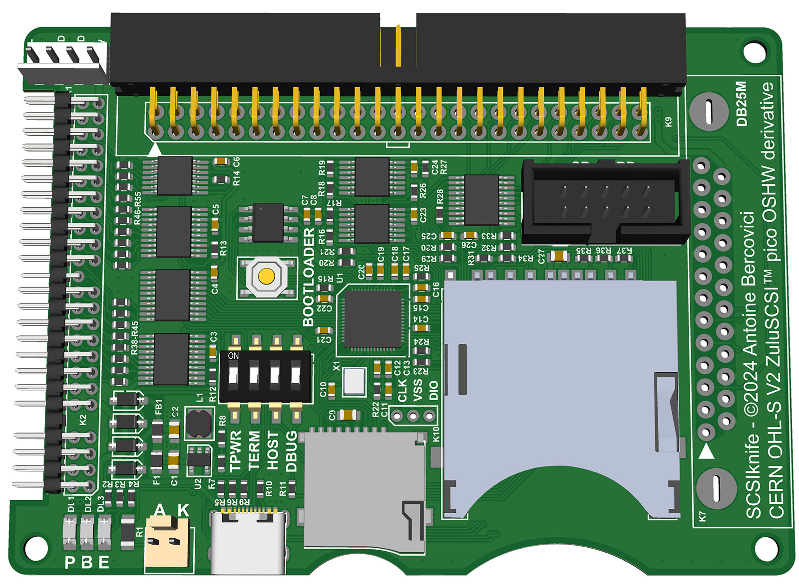

# SCSIknife

SCSIknife - A compact and versatile SCSI emulator.
Firmware compatible ZuluSCSI™ Pico OSHW derivative.



SCSIknife is based on ZuluSCSI™ Pico, which can be found here:
* [PCB](https://github.com/ZuluSCSI/ZuluSCSI-Pico-OSHW)
* [Firmware](http://github.com/ZuluSCSI/ZuluSCSI-firmware)

# User Manual

**TODO**

# Firmware

This board is 100% compatible with ZuluSCSI™.
As such, flashing instructions can be found [there](https://github.com/ZuluSCSI/ZuluSCSI-firmware?tab=readme-ov-file#programming--bootloader)

# Gerber generation

This PCB was designed with Adobe Illustrator, and exported as SVG files.

These SVG files are then converted to Gerber using the following tools:
* [Gerbolyze](https://github.com/jaseg/gerbolyze)
* [svg-to-gerber](https://github.com/Altomare/svg-to-gerber): for drill generation

If you need to re-generate gerbers, you can use the `svg-to-gerber.py` tool linked above:
```shell
# Illustrator uses 72 DPI instead of the usual 96 for SVG files, hence the 72 argument
svg-to-gerber.py SCSIknife/svg SCSIknife/gerber 72

# If you end up with a negative gerber on some layers, 
# re-run the svg-flatten command seen in logs without -f.
# It seems to behave differently on different setups
```

# License

SCSIknife inherits the license from ZuluSCSI Pico:
CERN Open Hardware Licence Version 2 - Strongly Reciprocal

See [CERN Open Hardware Licence Version 2](license.txt)
