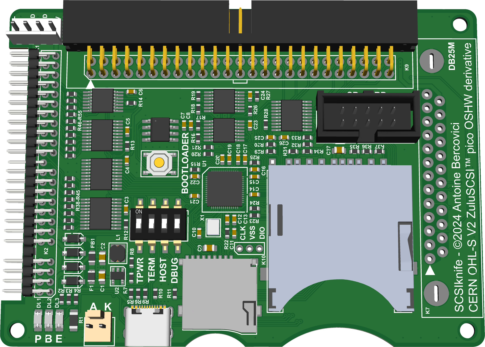
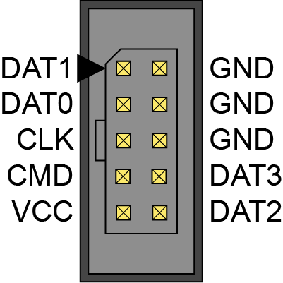

# SCSIknife

SCSIknife - A compact and versatile SCSI emulator.

SCSIknife is a ZuluSCSI™ Pico OSHW derivative, compatible with ZuluSCSI™ firmware.



SCSIknife has the same compact footprint as a 2.5" hard disk drive, yet provide a rich SCSI connectivity with a male DB25 connector, HE-10 50-pin and 50-pin 2.5" for laptops. Two SD card sockets can accomodate standard SD cards as well as micro SD cards (only one type can be used at a time). A HE-10 10-pin connector expose the SD card signals in order to extend the SD card connector away from SCSIknife.

# Hardware

SCSIknife require 5.0VDC ± 0.5V which can be supplied by the SCSI termination, the 4-pin Berg style connector, the 2.5" SCSI connector, or USB-C.
For host systems not providing SCSI termination power on the bus, SCSIknife can backfeed termination power by enabling the "TPWR" switch.

The HE-10 10-pin SD card extension connector use the following pinout:



Status LED is connected to RP2040 GPIO16

Error LED is connected to RP2040 GPIO25

# Firmware

SCSIknife is 100% compatible with the ZuluSCSI™ firmware.
As such, flashing instructions can be found [there](https://github.com/ZuluSCSI/ZuluSCSI-firmware?tab=readme-ov-file#programming--bootloader)

To update the firmware, press and hold the “Bootloader” button before plugging in the USB C connection to a computer. SCSIknife will appear as a drive on the desktop. Drop the new firmware file in `.uf2` format on the disk and SCSIknife will automatically update and disconnect itself upon completion. 

# Gerber generation

This PCB was designed with Adobe Illustrator, and exported as SVG files.

These SVG files are then converted to Gerber using the following tools:
* [Gerbolyze](https://github.com/jaseg/gerbolyze)
* [svg-to-gerber](https://github.com/Altomare/svg-to-gerber): gerbolyze wrapper + drill file generation

If you need to re-generate gerbers:
```shell
# Illustrator uses 72 DPI instead of the usual 96 for SVG files
svg-to-gerber.py SCSIknife/svg SCSIknife/gerber 72

# If you end up with a negative gerber on some layers, 
# re-run the svg-flatten command seen in logs without -f.
# It seems to behave differently on different setups
```

# License and disclaimer

SCSIknife is based on ZuluSCSI™ Pico OSHW, which can be found here:
* [ZuluSCSI™ Pico OSHW](https://github.com/ZuluSCSI/ZuluSCSI-Pico-OSHW)
* [ZuluSCSI™ Firmware](http://github.com/ZuluSCSI/ZuluSCSI-firmware)

ZuluSCSI™ is a registered trademark of Rabbit Hole Computing.

SCSIknife inherits the CERN-OHL-S-2.0 license from ZuluSCSI Pico

See [license.txt](LICENSE.txt)
